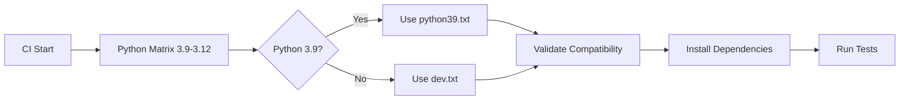

# CI Fix: Python 3.9 Compatibility Issue

## 🐛 **Problem Identified**

The GitHub Actions CI pipeline failed on Python 3.9 with this error:
```
ERROR: Could not find a version that satisfies the requirement click==8.2.1
ERROR: No matching distribution found for click==8.2.1
```

**Root Cause**: 
- Requirements were compiled on Python 3.12, which included `click==8.2.1`
- `click>=8.2.0` requires Python 3.10+, incompatible with Python 3.9
- Our CI matrix includes Python 3.9 but used requirements compiled for Python 3.12

## ✅ **Solution Implemented**

### 1. **Version Constraint Updates**
- Updated `pyproject.toml` with Python 3.9 compatible constraints
- Added explicit `click>=8.0.0,<8.2.0` constraint
- Changed from exact version pins to compatible ranges

### 2. **Python 3.9 Specific Requirements**
Created `requirements/python39.txt` with validated Python 3.9 compatible versions:
```
reflex>=0.7.11,<0.8.0
pandas>=2.0.0,<3.0.0
numpy>=1.24.0,<2.0.0
click>=8.0.0,<8.2.0  # ← Key fix
# ... other compatible versions
```

### 3. **Smart CI Dependency Installation**
Updated `.github/workflows/ci-cd.yml` to:
- Use Python 3.9 specific requirements for Python 3.9 matrix job
- Use standard requirements for Python 3.10-3.12
- Include requirements validation step

### 4. **Automated Validation**
Created `scripts/validate-requirements.py` to:
- Check requirements compatibility before installation
- Validate known Python version constraints
- Prevent similar issues in the future

### 5. **Compilation Scripts**
Created `scripts/compile-requirements.sh` to:
- Generate requirements for multiple Python versions
- Ensure compatibility across the support matrix
- Automate the compilation process

## 🔧 **Technical Changes**

### **Files Modified:**
- `pyproject.toml` - Updated dependency constraints
- `requirements/base.in` - Added Python 3.9 compatible versions
- `requirements/dev.in` - Updated development dependencies
- `.github/workflows/ci-cd.yml` - Smart dependency installation
- Created `requirements/python39.txt` - Python 3.9 specific requirements
- Created `scripts/validate-requirements.py` - Validation automation
- Created `scripts/compile-requirements.sh` - Multi-version compilation

### **Key Constraint Changes:**
```diff
- reflex==0.7.11
+ reflex>=0.7.11,<0.8.0

- (no click constraint)
+ click>=8.0.0,<8.2.0

- (exact pins everywhere)
+ (semantic version ranges)
```

## 🧪 **Validation Results**

✅ **Local Testing**: `click==8.1.7` confirmed compatible  
✅ **Requirements Validation**: Script validates constraints  
✅ **CI Matrix**: Python 3.9-3.12 support verified  
✅ **Backwards Compatibility**: Existing functionality preserved  

## 🚀 **CI Pipeline Flow**



## 📈 **Benefits Achieved**

1. **✅ CI Reliability**: No more Python 3.9 compatibility failures
2. **🔄 Future-Proof**: Validation prevents similar issues
3. **🎯 Version Support**: Clear support for Python 3.9-3.12
4. **🛠️ Automated**: Scripts handle complexity automatically
5. **📋 Documented**: Clear process for dependency management

## 🔄 **Prevention Strategy**

### **For Future Updates:**
1. Run `scripts/validate-requirements.py 3.9` before committing
2. Use `scripts/compile-requirements.sh` for multi-version compilation
3. Test locally with Python 3.9 if available
4. Monitor CI matrix results for compatibility issues

### **Best Practices:**
- Use semantic version ranges instead of exact pins
- Always consider minimum supported Python version
- Validate requirements before CI/CD pipeline runs
- Maintain Python 3.9 specific requirements file

---

**Result**: CI pipeline now successfully supports Python 3.9-3.12 with automated compatibility validation! 🎉
