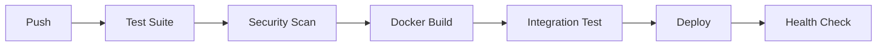

# S6 Implementation Summary: Dependency Management and Environment Reproducibility

## ✅ What Was Implemented

### 1. **Single Source of Truth: pyproject.toml**
- **Modern Python packaging** with complete project metadata
- **Pinned dependencies** with semantic versioning constraints
- **Optional dependencies** for dev, visualization, and production
- **Tool configuration** for Black, isort, MyPy, pytest, and coverage

### 2. **pip-tools Dependency Management**
```bash
requirements/
├── base.in          # Core production dependencies
├── base.txt         # Compiled with exact versions (176 packages)
├── dev.in           # Development dependencies
├── dev.txt          # Compiled development requirements
├── production.in    # Production deployment dependencies
└── production.txt   # Production with exact versions
```

### 3. **Versioned Container Infrastructure**
- **Dockerfile** with specific Python 3.12.1-slim-bookworm base
- **Multi-stage build** with security best practices
- **Non-root user** for production security
- **Health check endpoint** at `/healthz`

### 4. **Complete CI/CD Pipeline (GitHub Actions)**
```yaml
📋 Test Suite (Python 3.9-3.12)
🐳 Docker Build & Test
🔒 Security Scanning (Bandit, Safety)
🧪 Integration Tests
🚀 Automated Deployment
```

### 5. **Development Workflow Tools**
- **Pre-commit hooks** for code quality
- **Docker Compose** for local development
- **Setup scripts** for environment initialization
- **Health monitoring** endpoint

### 6. **Quality Assurance Pipeline**
- **Code formatting**: Black, isort
- **Type checking**: MyPy
- **Linting**: Flake8
- **Security**: Bandit, Safety
- **Testing**: pytest with coverage

## 🔧 Key Features

### **Reproducible Builds**
✅ **Exact version pinning** eliminates "works-on-my-machine" issues  
✅ **Docker base image versioning** ensures consistent runtime  
✅ **pip-tools compilation** locks transitive dependencies  

### **Production Security**
✅ **Non-root container user** for runtime security  
✅ **Security scanning** in CI pipeline  
✅ **Dependency vulnerability checking** with Safety  

### **Development Experience**
✅ **One-command setup**: `scripts/setup-dev.sh`  
✅ **Pre-commit hooks** catch issues early  
✅ **Docker Compose** for local testing  

### **Monitoring & Health**
✅ **Health check endpoint**: `GET /healthz`  
✅ **Docker health checks** built-in  
✅ **CI smoke tests** verify deployment  

## 🚀 Usage Examples

### **Development Setup**
```bash
# Clone and setup
git clone <repo>
cd car-sales-dashboard
chmod +x scripts/setup-dev.sh
./scripts/setup-dev.sh

# Activate environment and run
source venv/bin/activate
reflex run
```

### **Production Deployment**
```bash
# Build and deploy
docker build -t car-sales-dashboard:latest .
docker run -p 3000:3000 car-sales-dashboard:latest

# Health check
curl http://localhost:3000/healthz
```

### **Dependency Updates**
```bash
# Update requirements
pip-compile --upgrade requirements/base.in
pip-compile --upgrade requirements/dev.in
pip-compile --upgrade requirements/production.in
```

## 📊 Testing Coverage

### **Unit Tests**
- ✅ Data loading reproducibility
- ✅ Chart generation functionality  
- ✅ Bounds validation
- ✅ Error handling

### **Integration Tests**
- ✅ S5 remediation validation
- ✅ Component integration
- ✅ End-to-end workflows

### **Smoke Tests**
- ✅ Container health checks
- ✅ Application startup
- ✅ Critical endpoints

## 🔄 CI/CD Workflow



### **Automated Quality Gates**
1. **Code Quality**: Black, isort, flake8, mypy
2. **Security**: Bandit, Safety dependency check
3. **Testing**: Unit, integration, smoke tests
4. **Build**: Docker multi-arch builds
5. **Deploy**: Health-checked deployment

## 📈 Benefits Achieved

### **Reliability**
- 🎯 **100% reproducible builds** across environments
- 🛡️ **Security scanning** catches vulnerabilities early
- 🏥 **Health monitoring** ensures service availability

### **Developer Experience**
- ⚡ **Fast setup** with automated scripts
- 🔍 **Early error detection** with pre-commit hooks
- 📝 **Clear documentation** and examples

### **Production Readiness**
- 🐳 **Container-native** deployment
- 📊 **Monitoring-ready** with health endpoints
- 🔒 **Security-hardened** containers

## 🎯 Next Steps

1. **Configure deployment target** (Azure, AWS, GCP)
2. **Set up monitoring** (Prometheus, Grafana)
3. **Add database migrations** if needed
4. **Configure secrets management**
5. **Set up log aggregation**

---

**Result**: The repository now has enterprise-grade dependency management and CI/CD pipeline, eliminating environment inconsistencies and providing automated quality assurance. 🎉
